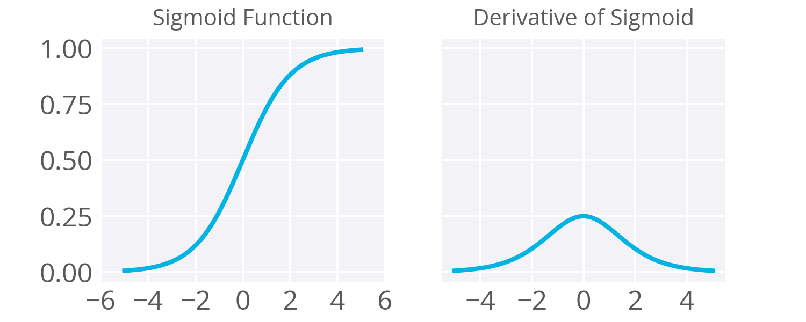
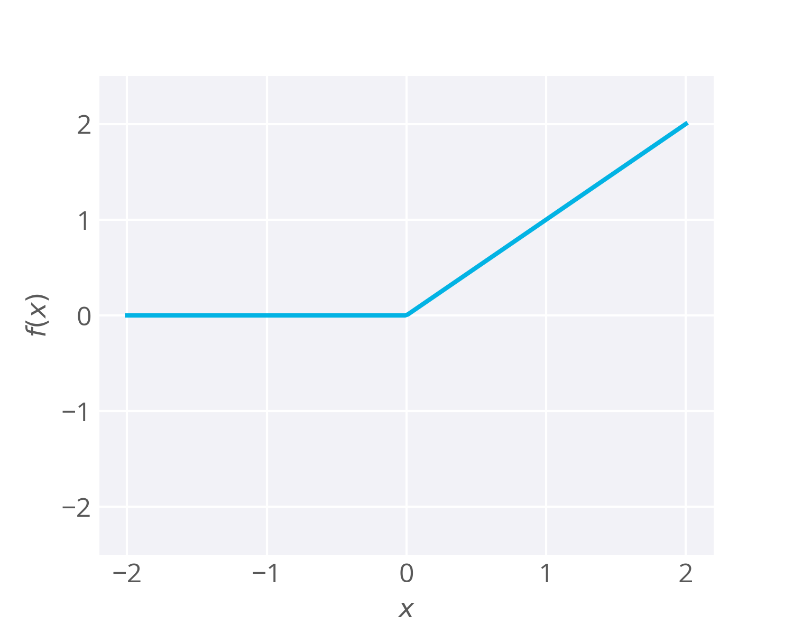

# Learn TFlearn - A high-level interface to TensorFlow

## Acivation Functions

- Sigmoid Function
	- **Drawbacks**
		- Maximum derivative value is 0.25. 
			- When you're performing backpropagation with sigmoid units, the errors going back into the network will be shrunk by at least a quarter at every layer. 
		- derivative vanishes in two side.
			- For layers close to the input layer, the weight updates will be tiny if you have a lot of layers and those weights will take a really long time to train. 
		- 
- Rectified Linear Units (ReLUs)
	- $f(x) = max(x, 0)$
	- **Advantage:** ReLUs result in much faster training for large networks
	- **Drawbacks**
		- ReLU units can be fragile during training and can “die”. Neurons that never activate across the entire training dataset, if learning rate is too high
		- A large gradient flowing through a ReLU neuron could cause the weights to update in such a way that the neuron will never activate on any datapoint again. 
		- **If this happens, then the gradient flowing through the unit will forever be zero from that point on.**
	- 
- Softmax (MultiClass Classification)
	- $f(x_i) = \frac{\exp(x_i)}{\sum_{j = 1}^K \exp(x_j)}$, where $k$ is the number of class
	- similar to sigmoid


## Error Metrics

- Categorical Cross-Entropy
	- **one-shot** encoding
		- Have a vector --> the length of the number of classes
		- The label element is marked with a 1 while the other labels are set to 0.
		- e.g. $y = [0, 0, 1, 0]$ means the lable is $3$
	- Output from data is **softmax** results
	- **cross-entropy**: from prediction $\hat{y}$ -> true value $y$
		- $D(\hat{y}, y) = - \sum_{j = 1}^{K} y_j\log \hat{y}_j$
		- **It's not symmstrical!**
		- Direction: prediction -> true, $D(\hat{y}, y)$

## Sentiment Analysis

### TFLearn installation

1. First things first, let's get you set up with TFLearn. You'll want to make a new environment called tflearn (or whatever you want to call it).
	- `conda create -n tflearn python=3.5`
2. enter the environment
	-	on macOS or Linux: `source activate tflearn`
	- on Windows: `activate tflearn`
3. Install packages
	`conda install numpy pandas jupyter notebook matplotlib`
4. Then, install TFLearn and its dependencies.
	- `conda install scipy h5py`
	- `pip install tensorflow`
		- If you have problems isntalling tensorflow, use [Google Tensorflow Information](https://www.tensorflow.org/versions/r0.10/get_started/os_setup#anaconda_installation)
	- `pip install TFLearn`

### Solutions

- The solution used 2 hidden layer, quite large 
- Have many good code snippets 

### Interesting Code

```python
#update counter with multiple incoming information
#Counter().update() 
#use _ for something we don't care

total_counts = Counter()
for _, row in reviews.iterrows():
    total_counts.update(row[0].split(' '))

```python
#define a dict

word2idx = {word: i for i, word in enumerate(vocab)}
```

## MNIST Exercise

## TFlearn to build a DNN model

```python
import numpy as np
import tensorflow as tf
import tflearn
import tflearn.datasets.mnist as mnist

# Define the neural network
def build_model():
    # This resets all parameters and variables, leave this here
    tf.reset_default_graph()
    
    # Inputs
    net = tflearn.input_data([None, trainX.shape[1]])

    # Hidden layer(s)
    # 20 is the number of nodes
    net = tflearn.fully_connected(net, 20, activation='ReLU')
    # just get another hidden layer
    net = tflearn.fully_connected(net, 20, activation='ReLU')

    # Output layer and training model
    net = tflearn.fully_connected(net, 10, activation='softmax')
    net = tflearn.regression(net, optimizer='sgd', learning_rate=0.01, loss='categorical_crossentropy')
    
    # This model assumes that your network is named "net"    
    model = tflearn.DNN(net)
    return model
```

Use the model

```python
model = build_model()

model.fit(trainX, trainY, validation_set=0.1, show_metric=True, batch_size=100, n_epoch=8)

# Compare the labels that our model predicts with the actual labels
predictions = (np.array(model.predict(testX))[:,0] >= 0.5).astype(np.int_)

# Calculate the accuracy, which is the percentage of times the predicated labels matched the actual labels
test_accuracy = np.mean(predictions == testY[:,0], axis=0)

# Print out the result
print("Test accuracy: ", test_accuracy)
```
